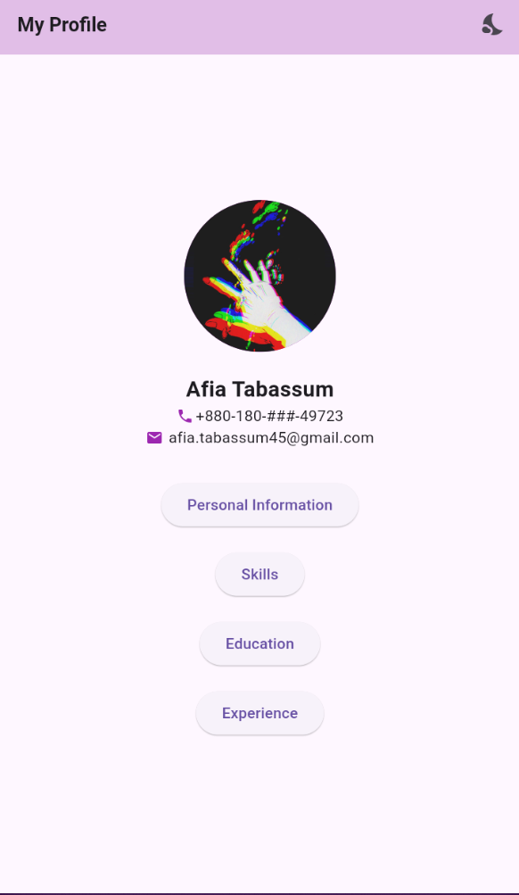
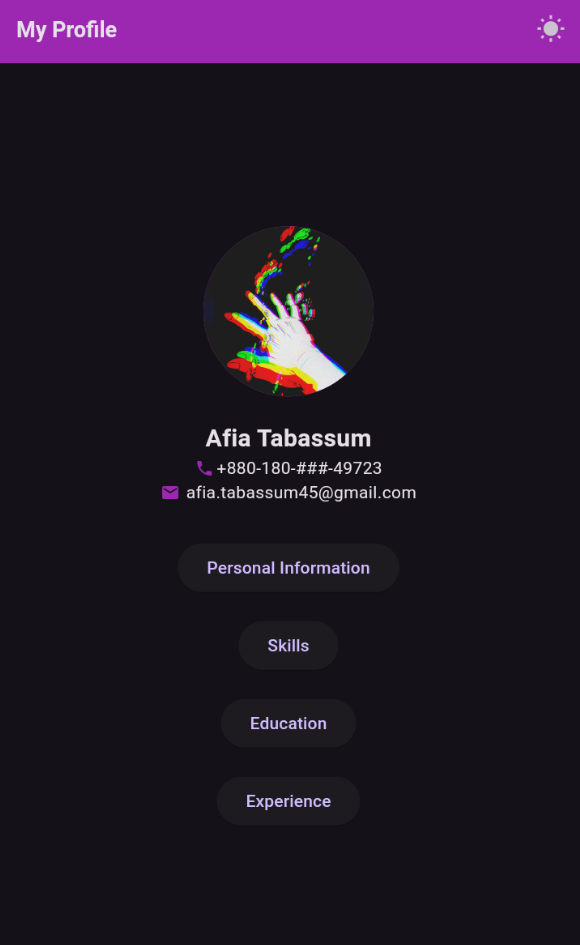

# Profile Mobile App

This repository/project is the first Mobile Developement Assignment by EDGE Digital Skills Training Program, Batch CBI-018 under our Instructor Noor Mohammad Anik Sir.

The Mobile App displays my profile along with 4 buttons, each displaying details in a new page of my: 
- Personal Information 
- Skills 
- Education
- Experience

## Tools and Languages

Flutter and Dart
## Additional Features
For experimenting purposes, I added the following features:

- Light/dark mode toggle
- Loading Screen


## Running Project

To run the project, select the device type and run the following command

```bash
  flutter run
```


## Screenshots (on BlueStacks Android Emulator)
1. **Home Page (Light Mode)**



2. **Home Page (Dark Mode)**



## 🔗 Links

- [YouTube](https://www.youtube.com/channel/UCVAEiPNfFBiI65Y60ZtKrNw "YouTube Channel") 
- [LinkedIn](https://www.linkedin.com/in/afia-tabassum-805361213/ "LinkedIn Profile")


